# Algoritmo de Tower Scan — Selección de Frecuencias PMP 450i

Este documento describe la lógica operativa completa del sistema, desde la adquisición de datos vía SNMP hasta la matemática de calificación de frecuencias óptimas, incluyendo el análisis cruzado AP-SM.

---

## Diagrama General del Flujo

```mermaid
flowchart TD
    START(["🚀 Iniciar Escaneo\n(APs + SMs via SNMP)"])

    subgraph SCAN["📡 Fase 1 — Tower Scan (SNMP)"]
        S1["Preparar SMs\nSNMP SET: Duration=60s, Mode=8"]
        S2{"¿Todos los SMs\npreparados?"}
        S3["❌ ABORT\nProteger integridad de red"]
        S4["Iniciar SMs\nSNMP SET: Action=1 (Start)"]
        S5["Iniciar APs\nSNMP SET: Action=1 (Start)"]
        S6["Polling: Esperar\nstatus=4 (IDLE/DONE)"]
        S7["Descargar XMLs\nHTTP GET /SpectrumAnalysis.xml"]
    end

    subgraph DISCOVERY["🔍 Fase 0.5 — Auto-Discovery"]
        D1["SNMP WALK linkTable\npor cada AP"]
        D2["Obtener: IP, MAC, site_name\npor cada SM registrado"]
        D3["Construir ap_sm_map\n{ap_ip → [sm_ips]}"]
    end

    subgraph AP_ANALYSIS["📊 Fase 2A — Análisis AP (Sliding Window)"]
        A1["Ventana deslizante\nCentro: Fmin → Fmax, paso 5 MHz"]
        A2["Calcular ruido en ventana\nnoise_V = max(vertical_max)\nnoise_H = max(horizontal_max)"]
        A3["chain_imbalance = |noise_V - noise_H|\nsnr_ap = target_rx − max(noise_V, noise_H)"]
        A4{"snr_ap ≥ umbral\nmodulacion?"}
        A5["Asignar Score Base\n256QAM→100 / 64QAM→75\n16QAM→50 / Inestable→0"]
        A6["Aplicar bonus/penalty\n+10 contigüidad\n−50 chain imbalance\n−BW penalty"]
        A7["Top 20 candidatos\npor ancho de banda"]
    end

    subgraph SM_CROSS["🔗 Fase 2B — Análisis Cruzado AP-SM (change-007)"]
        C1["Para cada frecuencia candidata del AP\ny para cada SM del sector..."]
        C2["Extraer ruido en ventana del canal\nnoise_V = max(vertical_max)\nnoise_H = max(horizontal_max)\nruido_mimo_peor = max(noise_V, noise_H)"]
        C3["⚡ Modelo SNR-Based\nbw_expansion = 10·log₁₀(bw / 5)\nruido_total = ruido_mimo_peor + bw_expansion\nseñal_est = target_rx − 10dB (fade margin)\nsnr_real = señal_est − ruido_total"]
        C4{"snr_real ≥ min_snr\n(default 18 dB)?"}
        C5["✅ SM: OK\nsnr_real expuesto\nen sm_details"]
        C6["❌ SM: VETADO\nCanal descalificado\nsi ≥1 SM veta"]
        C7["Calcular métricas agregadas\nsm_snr_worst = min(snr_real)\ncombined_score = ap_score − penalidades"]
    end

    subgraph DECISION["🏆 Fase 3 — Decisión Final"]
        F1["Ordenar candidatos\nby combined_score DESC"]
        F2["Seleccionar mejor\nfrecuencia viable"]
        F3["Clasificar calidad\nEXCELENTE / BUENO /\nACEPTABLE / MARGINAL /\nNO VIABLE"]
        F4["📋 Resultado\nfrecuencia + BW + snr_real\npor SM + calidad"]
    end

    START --> DISCOVERY
    DISCOVERY --> D1 --> D2 --> D3
    D3 --> SCAN
    S1 --> S2
    S2 -- "Sí" --> S4
    S2 -- "No" --> S3
    S4 --> S5 --> S6 --> S7
    S7 --> AP_ANALYSIS
    S7 --> SM_CROSS
    A1 --> A2 --> A3 --> A4 --> A5 --> A6 --> A7
    A7 --> SM_CROSS
    C1 --> C2 --> C3 --> C4
    C4 -- "Sí" --> C5
    C4 -- "No" --> C6
    C5 --> C7
    C6 --> C7
    C7 --> DECISION
    F1 --> F2 --> F3 --> F4

    style S3 fill:#7f1d1d,color:#fca5a5
    style C6 fill:#7f1d1d,color:#fca5a5
    style C5 fill:#14532d,color:#86efac
    style C3 fill:#1e3a5f,color:#93c5fd,stroke:#3b82f6,stroke-width:2px
    style F4 fill:#3b1d00,color:#fcd34d,stroke:#f59e0b,stroke-width:2px
```



---

## 1. Fase de Auto-Discovery (SNMP linkTable)

Antes de iniciar el escaneo, el sistema descubre automáticamente qué SMs están registrados en cada AP mediante un SNMP WALK sobre la `linkTable`.

```pseudo
PROCEDURE Auto_Discovery(APs):
    ap_sm_map = {}

    PARA CADA ap EN APs:
        sms = SNMP_WALK(ap, OID_LINK_TABLE)
        // Extrae: IP de gestión (.69), MAC (.3), site_name (.33), estado (.19)

        ap_sm_map[ap] = [sm.ip PARA sm EN sms SI sm.state == IN_SESSION]

    RETORNAR ap_sm_map
    // Resultado: {ap_ip → [sm_ip_1, sm_ip_2, ...]}
```

---

## 2. Fase de Escaneo (Tower Scan SNMP)

```pseudo
PROCEDURE Iniciar_Escaneo(APs, SMs):

    // CANDADO 1: Preparar SMs primero
    PARA CADA sm EN SMs:
        SNMP_SET(sm, OID_DURATION, 60)   // Duración extendida (SMs son más lentos)
        ok = SNMP_SET(sm, OID_MODE, 8)   // Full Scan

        SI ok == FALLO:
            RETORNAR ERROR "Abortar — SM no responde. Red protegida."

    // CANDADO 2: Iniciar SMs en paralelo
    PARA CADA sm EN SMs:
        ok = SNMP_SET(sm, OID_ACTION, 1)  // Start
        SI ok == FALLO:
            RETORNAR ERROR "Abortar — AP no iniciará sin todos los SMs."

    // Solo si ambos candados pasan → iniciar APs
    PARA CADA ap EN APs:
        SNMP_SET(ap, OID_DURATION, 40)
        SNMP_SET(ap, OID_MODE, 8)
        SNMP_SET(ap, OID_ACTION, 1)

    // Polling hasta completar
    MIENTRAS Tiempo < Timeout:
        SI TODOS SNMP_GET(dispositivo, OID_STATUS) == 4 (IDLE):
            ROMPER

    // Descarga de XMLs por HTTP
    PARA CADA dispositivo EN (APs + SMs):
        XML = HTTP_GET("http://{IP}/SpectrumAnalysis.xml")
        Guardar(Parsear_XML(XML))
        // Estructura: [{frecuencia, max_V, mean_V, max_H, mean_H}]
```

---

## 3. Fase de Análisis AP — Scoring con Ventana Deslizante

```pseudo
FUNCTION Analizar_AP(espectro, ancho_banda, target_rx):

    candidatos = []
    centro = Fmin + (ancho_banda / 2)

    MIENTRAS centro + (ancho_banda / 2) <= Fmax:

        ventana = [p PARA p EN espectro SI centro−BW/2 <= p.freq <= centro+BW/2]

        // 1. Ruido conservador (peor caso)
        noise_V = MAX(ventana.vertical_max)
        noise_H = MAX(ventana.horizontal_max)

        // 2. Chain imbalance (detecta pérdida de MIMO-B)
        chain_imbalance = ABS(noise_V - noise_H)

        // 3. SNR estimado del AP
        snr_ap = target_rx - MAX(noise_V, noise_H)

        // 4. Score base por modulación
        SI snr_ap >= 32: score = 100, mod = "256QAM (8X)"
        SI snr_ap >= 24: score = 75,  mod = "64QAM (6X)"
        SI snr_ap >= 17: score = 50,  mod = "16QAM (4X)"
        SI snr_ap >= 10: score = 25,  mod = "QPSK (2X)"
        SINO:            score = 0,   mod = "Inestable"

        // 5. Penalización MIMO-A (chain imbalance > 5 dB)
        SI chain_imbalance > 5:
            score -= 50
            mod += " [degradado MIMO-A]"

        // 6. Detección de Burst Noise
        burst = MAX(ventana.max - ventana.mean)
        SI burst > 10: Generar_Advertencia("Interferencia intermitente")

        // 7. Bonus contigüidad
        SI StdDev(ventana) < 3: score += 10

        // 8. Bonus/Penalización por BW
        score += BW_BONUS[ancho_banda]  // {5:−10, 10:−5, 15:+5, 20:0}

        candidatos.ADD({centro, score, snr_ap, mod})
        centro += 5  // Paso de la ventana deslizante

    RETORNAR Ordenar(candidatos, POR score DESC).TOP_20
```

---

## 4. Fase de Análisis Cruzado AP-SM — Evaluación SNR-Based *(change-007)*

> **Por qué reemplazamos el umbral fijo:**
> El sistema anterior vetaba si `noise_avg > -75 dBm`. Esto era **ciego**: ignoraba el nivel de señal real del enlace. Un canal con -74 dBm de ruido pasaba aunque el SNR fuera 3 dB; otro con -76 dBm era rechazado aunque el enlace tuviera 30 dB de margen.

```pseudo
FUNCTION Evaluar_Canal_Para_SM(ruido_mimo_peor, bandwidth, target_rx, min_snr=18):

    // 1. Penalización por expansión de canal
    //    El escaneo se hace a resolución de 5 MHz.
    //    Un canal de 20 MHz integra 4x más ancho → más potencia de ruido.
    //    Penalización = 10·log₁₀(bw / 5)
    //      5 MHz  → +0.0 dB
    //      10 MHz → +3.0 dB
    //      15 MHz → +4.8 dB
    //      20 MHz → +6.0 dB
    bw_expansion_db = 10 * log10(bandwidth / 5)

    // 2. Ruido total del canal real
    ruido_total = ruido_mimo_peor + bw_expansion_db

    // 3. Señal estimada con Fade Margin
    //    Fade Margin = 10 dB (estándar de ingeniería RF, constante)
    señal_estimada = target_rx - 10

    // 4. SNR real del enlace en este canal
    snr_real = señal_estimada - ruido_total

    // 5. Decisión
    SI snr_real < min_snr:
        RETORNAR VETADO, snr_real,
            "SNR insuficiente: {snr_real} dB (requerido: {min_snr} dB,
             ruido canal: {ruido_total} dBm)"
    SINO:
        RETORNAR OK, snr_real, "OK"


FUNCTION Analizar_Frecuencia_En_SMs(freq, ap_score, sm_data, bandwidth, target_rx, min_snr):

    sm_snrs = []
    vetados = 0

    PARA CADA sm EN sm_data:
        ventana = sm.espectro EN [freq - BW/2, freq + BW/2]

        // Peor caso MIMO: el canal opera con AMBAS polaridades
        noise_V = MAX(ventana.vertical_max)
        noise_H = MAX(ventana.horizontal_max)
        ruido_mimo_peor = MAX(noise_V, noise_H)

        estado, snr_real, razon = Evaluar_Canal_Para_SM(
            ruido_mimo_peor, bandwidth, target_rx, min_snr
        )

        sm_snrs.ADD(snr_real)
        SI estado == VETADO: vetados += 1

        // snr_real queda expuesto en sm_details para el frontend

    // Score combinado
    SI vetados > 0:
        combined_score = ap_score + (−50 × vetados)
        is_viable = FALSO
        veto_reason = "{vetados} SM(s) con SNR insuficiente
                       (peor SNR: {MIN(sm_snrs)} dB)"
    SINO:
        combined_score = ap_score − penalidad_ruido_promedio
        is_viable = VERDADERO
        sm_snr_worst = MIN(sm_snrs)

        SI sm_snr_worst < min_snr + 5:
            quality = "MARGINAL"  // Margen estrecho → advertencia

    RETORNAR {combined_score, is_viable, sm_snr_worst, sm_details}
```

---

## 5. Parámetros Configurables

| Parámetro | Default | Descripción |
|:---|:---:|:---|
| `target_rx_level` | `-52 dBm` | RSSI esperado del enlace, definido por el operador según link budget |
| `min_snr` | `18 dB` | SNR mínimo requerido para que un SM no vete la frecuencia |
| `fade_margin` | `10 dB` | Margen de desvanecimiento (constante — estándar RF, no configurable) |
| `min_channel_width` | `15 MHz` | BW mínimo a evaluar en el análisis multibanda |
| `max_chain_imbalance` | `5 dB` | Diferencia máxima V/H antes de degradar a MIMO-A |

---

## 6. Matriz de Decisión de Calidad

| Calidad | Criterios (AP Only) | Criterios (AP-SM Cross) | Significado |
| :--- | :--- | :--- | :--- |
| **EXCELENTE** | SNR ≥ 32 dB & ΔVH ≤ 3 dB | combined_score > 70 & todos SMs OK | Canal ideal. 256QAM estable. |
| **BUENO** | SNR ≥ 24 dB | combined_score > 50 & todos SMs OK | Buen rendimiento. 64QAM. |
| **ACEPTABLE** | SNR ≥ 17 dB | combined_score > 0 & todos SMs OK | Funcional, 16QAM. Monitorizar. |
| **MARGINAL** | SNR ≥ 10 dB | sm_snr_worst < min_snr + 5 dB | Margen estrecho. Riesgo de caídas. |
| **NO VIABLE** | SNR < 10 dB | ≥ 1 SM con snr_real < min_snr | ❌ No usar. SNR insuficiente. |

---

## 7. Ejemplo Numérico — Evaluación SNR-Based

Dados los siguientes parámetros:
- `target_rx = -52 dBm` (configurado, link budget del sector)
- `bandwidth = 20 MHz`
- `min_snr = 18 dB`
- `fade_margin = 10 dB` (constante)

| Escenario | noise_V | noise_H | ruido_mimo_peor | bw_expansion | ruido_total | señal_est | snr_real | Estado |
|:---|:---:|:---:|:---:|:---:|:---:|:---:|:---:|:---:|
| Canal limpio | -95 dBm | -93 dBm | -93 dBm | +6 dB | -87 dBm | -62 dBm | **25 dB** | ✅ OK |
| Canal ruidoso | -78 dBm | -80 dBm | -78 dBm | +6 dB | -72 dBm | -62 dBm | **10 dB** | ✅ OK (marginal) |
| Canal vetado | -72 dBm | -75 dBm | -72 dBm | +6 dB | -66 dBm | -62 dBm | **4 dB** | ❌ VETADO |
| Pre-change-007 | -74 dBm | -76 dBm | — | — | -75 dBm avg | — | *(ignorado)* | ✅ **PASABA** (falso positivo) |

> ⚠️ **El último caso muestra el bug pre-change-007**: con un promedio de -75 dBm (justo bajo el umbral de -75), el canal pasaba — aunque el SNR real era apenas 3 dB. El nuevo modelo lo habría detectado y vetado correctamente.

---

## 8. Flujo de Datos — Campos Expuestos por SM

Cada SM en `sm_details[]` ahora incluye:

```json
{
    "ip": "192.168.1.50",
    "noise_v": -93.0,
    "noise_h": -91.0,
    "noise_mimo_worst": -91.0,
    "snr_real": 19.0,
    "vetoed": false,
    "reason": "OK"
}
```

Y en `best_combined_frequency`:
```json
{
    "frequency": 5735.0,
    "bandwidth": 20,
    "sm_snr_worst": 19.0,
    "is_viable": true,
    "veto_reason": ""
}
```

---

*Versión 3.0 — change-007: SNR-based channel evaluation*
*Torre Scan Automation System — Cambium PMP 450i*
